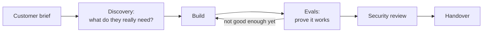

# FDE Training

A free, build-first course that takes you from your first line of code to the skills of a **Forward Deployed Engineer**, using Claude.

!!! info "Status"
    **Launchpad** (for beginners) and **Phase 1** are written. Phases 2–5 are outlined in the [syllabus](syllabus.md) and are being written one at a time.

## What is a Forward Deployed Engineer?

A Forward Deployed Engineer (FDE) is a software engineer who works **with a customer, inside their world**. Instead of building one product for millions of users, an FDE sits with one organisation (an insurer, a hospital, a retailer), learns how their work actually gets done, and builds AI systems that fit it. Then they prove those systems work and hand them over so the customer's own team can run them.

A typical engagement looks like this:

It's a mix of engineering, problem-solving and people skills. Companies building AI products, including Anthropic, hire FDEs to get their technology working inside real businesses. See [The FDE role](reference/fde-role.md) for what employers ask for.

## Who this course is for

- **Career changers and beginners** who've never programmed. Start at **Launchpad**.
- **Developers, IT and data professionals** who can already code. Take the skip test and start at **Phase 1**.
- **Anyone already working with AI** who wants a structured path to building, evaluating and delivering real systems.

You don't need a computer science degree or prior AI experience.

## What you need before you start

| You need | Why |
|---|---|
| Basic computer skills: installing apps, finding files, using a web browser | Everything else builds on these |
| A computer you can install software on: Windows 10/11, macOS or Linux, 8 GB RAM or more | You'll install Python, Git and a code editor. A locked-down work laptop usually won't do |
| Reading English technical documentation | Most tools and docs you'll use are in English |
| About **8–12 hours a week** | The pace the course is designed for |
| A free GitHub account | To get the course files and save your own work |
| From Phase 1 onwards: a Claude API account with a little prepaid credit and a payment method | The labs call the Claude API. See [Costs](costs.md); most learners spend tens of dollars over the whole course |

Already know some of this? The [Launchpad skip test](launchpad/index.md#skip-test) tells you where to start.

## Two routes

| Your starting point | Start at | Length |
|---|---|---|
| New to coding | [Launchpad](launchpad/index.md) (8 weeks), then Phase 1 | about 32 weeks |
| You can write small Python scripts, use git and call an API | [Phase 1](phase-1/index.md) after the [setup](setup/index.md) | about 24 weeks |

## How the course is built

| Part | Weeks | You'll be able to | Practice customer |
|---|---|---|---|
| **Launchpad** | L1–L8 | Use a terminal, write Python, use Git and GitHub, call web APIs, write tests | Your own small tool |
| **1 · Foundations** | 1–4 | Call Claude reliably, write prompts that hold up, prove quality with evals | Lakeshore Mutual (insurance) |
| **2 · Production** | 5–10 | Build tool-using agents, retrieval and integrations, and secure them | Northwind Outfitters (retail) |
| **3 · Agents and MCP** | 11–16 | Build MCP servers and multi-step agents, and monitor them | Fernway (software company) |
| **4 · Architecture** | 17–22 | Design for regulated customers, cost and scale; ship services; run discovery | Harbourview Health (healthcare) |
| **5 · Residency simulation** | 23–24 | Deliver an unseen scenario under time pressure; build your portfolio | Drawn at random |

All the customers are fictional and all the data is synthetic.

Each week has a **lesson**, hands-on **labs** you run on your own computer, **exercises** marked *Core* or *Stretch*, and a **checkpoint** list. Phase 1 onward ends each phase with a capstone run like a real engagement.

## Start here

1. Read the [course rules](rules.md). They're short.
2. New to coding? Go to [Launchpad](launchpad/index.md). Otherwise do the [setup](setup/index.md), then [Phase 1](phase-1/index.md).
3. Keep notes in the [progress log](progress.md).
4. Stuck on a word? Check the [glossary](glossary.md).

!!! note "Not official material"
    This is an independent study course. It isn't affiliated with or endorsed by Anthropic or any other company named in it. Facts about products and prices were checked on the date shown on each page; re-check before relying on them. Found a mistake? [Open an issue](https://github.com/darolution/FDE-Training/issues).
