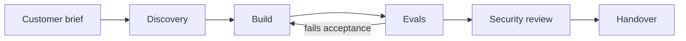

# FDE Training

A 24-week, build-first path to the skills of a **Forward Deployed Engineer**: the engineer who sits with a customer, works out what they actually need, builds a Claude-powered system that works in their environment, proves it works, and hands it over so it keeps working.

!!! info "Status"
    **Phase 1 (Weeks 1–4) is complete**: lessons, runnable labs, datasets, tests and the first capstone. Phases 2–5 are outlined in the [syllabus](syllabus.md) and get written one phase at a time.

## How the course works

Every phase ends in a **capstone for a different (fictional) customer in a different industry**, run the way real deployments run:

That loop mirrors the format of Anthropic's own [FDE Residency](reference/fde-role.md): build a Claude system for an enterprise scenario "from the first customer request through security review to handover".

| Phase | Weeks | You build | Customer |
|---|---|---|---|
| 1 · Foundations | 1–4 | Structured extraction + evals | Lakeshore Mutual (insurance) |
| 2 · Production | 5–10 | Tool-using support agent | Northwind Outfitters (retail) |
| 3 · Agents and MCP | 11–16 | MCP servers + ops agent | Fernway (B2B SaaS) |
| 4 · Architecture | 17–22 | RAG + agent platform for a regulated client | Harbourview Health (healthcare) |
| 5 · Residency sim | 23–24 | An unseen scenario, time-boxed | Drawn at random |

A **security track** (Splunk, SIEM alert triage, agent threat modelling) runs alongside as stretch labs, and Phase 3 uses Splunk as the observability backend for your agents.

## Each week has

- **Lesson**: the concepts, kept short and current, with links to the primary docs.
- **Labs**: small runnable scripts in `labs/weekNN/`. Run, read, then change them. Each lab lists exercises.
- **Checkpoint**: what you should be able to do before moving on. If you can already do it, skip ahead.

## Start here

1. Read the [course rules](rules.md). They're short and they protect your job.
2. Do the [setup](setup/index.md) (about an hour).
3. Start [Phase 1](phase-1/index.md).
4. Log each week in the [progress log](progress.md).

!!! note "Not official material"
    This is a personal study course. It isn't affiliated with or endorsed by Anthropic or Splunk. Facts about products and prices were checked on the date shown on each page. Re-check before relying on them.
