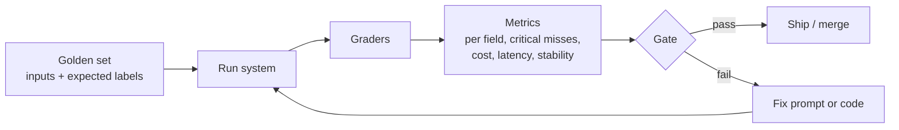

# Week 3 · Evals

**Goal:** replace "it seems to work" with numbers a customer will sign off on. This is the most important week in Phase 1. Every capstone from here on is judged by an eval you build.

## Lesson

### Why FDEs live in evals

A demo shows that a system *can* work. An eval shows *how often* it works, *where* it fails, and whether yesterday's prompt change broke something. It's how you:

- agree **acceptance criteria** with a customer before you build,
- choose a model on evidence (quality per dollar),
- change prompts without fear (regression gate),
- hand over a system the customer can keep improving.

### Anatomy of an eval



**Golden set.** Real-looking inputs with the answers a domain expert agrees on. Start with 20–50 cases that **over-represent the hard ones**: ambiguity, other languages, injection, edge thresholds. `tickets_golden.jsonl` has 24.

**Acceptable answers, not single answers.** When reasonable experts would disagree (is a $640 refund demand "high" or "urgent"?), the golden set lists *both* as acceptable. Forcing one answer measures your labelling, not the model.

**Graders**, cheapest first:

1. **Code**: exact match, set membership, ranges, regexes, "does the SPL parse". Fast, free, deterministic. Use them wherever you can.
2. **LLM-as-judge**: for free text (is this summary faithful?). Use a strong model, a narrow rubric and structured output, and **calibrate it against your own labels** before you trust it.
3. **Human review**: for the cases the first two flag, and to keep the judge honest.

**Not all errors are equal.** A misfiled promo-code question costs nothing. A missed escalation on a burn injury is the incident that ends the pilot. `graders.py` reports **critical misses** separately, and the gate can fail on any of them.

**Stability.** Even with identical inputs, outputs vary. Run cases more than once (`--repeats 3`) and report how often the answer is the same.

### Using evals in delivery

- Write the eval *before* tuning the prompt. Tuning first makes you overfit to the cases you remember.
- Change **one thing at a time**, re-run, and diff (`compare_runs.py`).
- Keep a held-out slice you don't look at while tuning, and report on it at the end.
- Put the eval in CI with a gate (`--min-accuracy`, `--no-critical`). Phase 3 wires this up.

## Labs

| Lab | Run | What you learn |
|---|---|---|
| 1 | `python labs\week03\run_eval.py --model fast` | Per-field accuracy, critical misses, cost, p50/p95 latency |
| 1b | `python labs\week03\run_eval.py --model fast --repeats 3` | Stability across repeats |
| 2 | `python labs\week03\compare_runs.py <runA.json> <runB.json>` | What a prompt change fixed and what it broke |
| 3 | `python labs\week03\judge.py --run labs\runs\w2_triage_fast.jsonl` | LLM-as-judge for summaries, then calibrate it against your own grades |

??? example "The grader (code-based, unit tested)"
    ```python
    --8<-- "labs/week03/graders.py:grade_ticket"
    ```

### Exercises

1. **Model selection.** Run the eval on `fast` and `default`. Fill in the table below and write a three-sentence recommendation to Northwind's support director.

    | Model | All fields correct | Critical misses | p95 latency | Cost per 1,000 tickets |
    |---|---|---|---|---|
    | | | | | |

2. **Fix a failure properly.** Pick the most common failing field. Change the prompt once, re-run, and use `compare_runs.py`. Did anything regress?
3. **Grow the golden set.** Add four tickets that you think will break the current prompt (sarcasm, two requests in one ticket, an order id with a typo, a French injection attempt). Label them *before* running. How many did you predict correctly?
4. **Gate it.** Find the highest `--min-accuracy` your best prompt passes reliably over three runs. That's a defensible acceptance criterion.

## Checkpoint

- [ ] You have a saved eval run for two models and a written recommendation
- [ ] You've made at least one prompt change that the diff shows improved things with no regressions
- [ ] You and the judge agree on at least 80% of hand-graded summaries, or you've tightened the rubric until you do

## Read

- [Define success criteria and build evaluations](https://platform.claude.com/docs/en/test-and-evaluate/develop-tests)
- [Building effective agents](https://www.anthropic.com/engineering/building-effective-agents), for the evaluator-optimizer pattern you'll use in Phase 3
